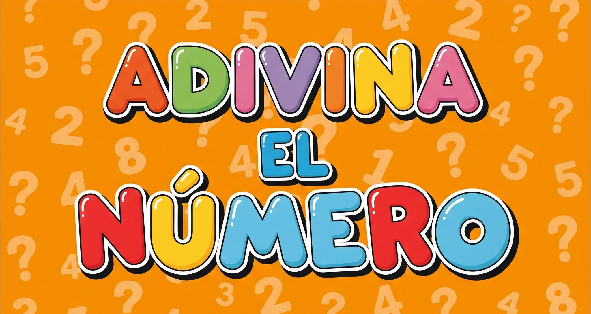

# 🧠 Juego Adivina el Número (4 cifras)

Este proyecto es un juego interactivo en consola donde **la computadora intenta adivinar un número secreto de 4 dígitos** que tú has pensado. El rango es desde `0000` hasta `9999`.  

---

## 🎮 ¿Cómo jugar?

1. Piensa en un número secreto de 4 cifras (ejemplo: `0423` o `9999`).
2. El programa hará intentos adivinando ese número.
3. Tú debes responder **cuántos dígitos ha acertado el programa en la posición correcta**, un número entre 0 y 4.
4. Con cada pista, el programa refina sus siguientes intentos hasta adivinar tu número.
5. Cuando el programa acierte los 4 dígitos en su lugar correcto, ¡ganará!

---

## 📋 ¿Qué hace el programa?

- Genera todas las combinaciones posibles de números de 4 dígitos (`0000` a `9999`).
- En cada intento, elige un número candidato **aleatorio** de la lista restante de posibilidades.
- Compara la respuesta del usuario (cantidad de dígitos correctos en posición) para filtrar la lista de candidatos.
- Repite hasta adivinar el número o agotar las posibilidades.
- Incluye validación para asegurar que la respuesta sea un número válido entre 0 y 4.
- Controla posibles errores de entrada con mensajes amigables.

---

## 💡 Posibles mejoras futuras

- Implementar un método más inteligente para elegir el próximo intento (por ejemplo, usando minimax).
- Añadir una interfaz gráfica o versión web.
- Mejorar la interacción para manejar respuestas erróneas o incoherentes.
- Guardar estadísticas de partidas o número medio de intentos.

---

## 🛠 Tecnologías usadas

- Java 11+
- Entrada/salida por consola
- Uso básico de colecciones (`List`, `ArrayList`) y control de flujo

---

## 📥 Cómo ejecutar

1. Clona este repositorio
2. Compila y ejecuta el programa con:

~~~
javac org/example/AdivinaNumero.java
java org.example.AdivinaNumero
~~~

3. Sigue las instrucciones en pantalla.

---

## 📢 Contacto

Si tienes ideas o mejoras para el juego, ¡abre un issue o envía un pull request!  
Ig : Nikoganfornina

---

¡Diviértete jugando y mejorando este reto de lógica y programación! 🎉
